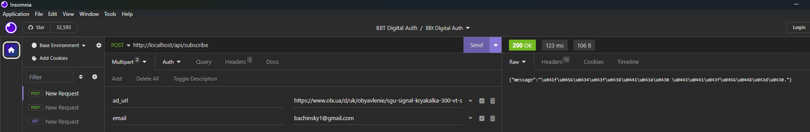

# Сервіс відстеження ціни на OLX

Цей сервіс розроблено з використанням технологій Laravel (на бекенді) та Vue 3 (на фронтенді). Він надає можливість користувачам відстежувати зміни цін на оголошення на OLX і отримувати сповіщення по електронній пошті.

## Технології
**Laravel**: Фреймворк PHP для створення веб-додатків. Використовується для реалізації бекенду сервісу, обробки запитів, роботи з базою даних та інших серверних операцій.

**Vue 3**: Прогресивний JavaScript-фреймворк для створення інтерфейсів користувача. Використовується для реалізації фронтенду сервісу, включаючи інтерактивність і відображення даних.

## Функціонал

- **Підписка**: Користувачі можуть підписатися на отримання сповіщень про зміни цін для певного оголошення, вказавши посилання на оголошення та свою електронну адресу.
- **Відстеження цін**: Сервіс постійно відстежує ціну на підписаному оголошенні.
- **Сповіщення по електронній пошті**: Коли виявляються зміни ціни, сервіс відправляє сповіщення на електронну пошту підписаному користувачу.
- **Кілька підписників**: Сервіс ефективно обробляє кілька підписників для одного і того ж оголошення, щоб уникнути зайвих перевірок цін.

## Початок роботи

Для запуску сервісу локально дотримуйтесь наступних кроків:

### Передумови

- Docker встановлено на вашому комп'ютері

### Встановлення

1. Клонуйте репозиторій:

   `git clone https://github.com/bachinsky1/OLX-prices-watcher.git`

2. Перейдіть до директорії проекту:

   `cd OLX-prices-watcher`

3. створіть файл .env

   `> .env`

4. Скопіюйте вміст файла `.env.example` в `файл .env`

5. Налаштуйте секцію файлу .env на використання власного SMTP сервера:

    `MAIL_MAILER=smtp`

    `MAIL_HOST='smtp.gmail.com`

    `MAIL_PORT=587`

    `MAIL_USERNAME='someuser@gmail.com`

    `MAIL_PASSWORD='somepassword`

    `MAIL_ENCRYPTION=tls`

    `MAIL_FROM_ADDRESS="someuser@gmail.com"`

    `MAIL_FROM_NAME="${APP_NAME}"` 

3. Запустіть докер:

    `docker-compose up -d`

4. Установіть залежності:

    `composer install && npm install`

5. Запустіть міграції та побудуйте фронтенд

    `php artisan migrate && npm run build`

6. Запустіть тести:

    `php artisan test`

## Використання

### API Ендпоінти

1. Підписка

        URL: /subscribe
        Метод: POST
        Тіло запиту:

        {
            "ad_url": "https://olx.ua/.........",
            "email": "user@example.com"
        }

2. Підтвердження пошти
        
        URL: /confirm-email/{token}
        Метод: GET 

3. Зміни цін

        URL: /changes
        Метод: GET

4. Перелік підписок

        URL: /subscriptions
        Метод: GET

### Ви можете використовувати інструменти типу **Postman** або **Insomnia** для відправки запитів, або веб інтерфейс, що доступний за адресою http://localhost/. Також можна користуватись phpMyAdmin за посиланням http://localhost:8080/ для доступу до дази даних MySQL.

Створіть нову підписку

Відкрийте електронну пошту та підтвердіть реєстрацію

Після цього ви зможете отримувати повідомлення на email в разі зміни ціни на сайті.

Також зміни цін можна переглянути за посиланням http://localhost/price-changes

Список підписок можна переглянути за посиланням http://localhost/subscriptions

Для того щоб земулювати зміну ціни на товар на сайті OLX
Розкоментуйте строки в файлі `app\Console\Commands\PriceMonitor.php` як на скріншоті нижче

Також можна користуватись інструментами для тестування REST API

## Парсинг сторінки товару
Під час розробки сервісу відстеження цін на OLX, я використовував метод парсингу сторінки товару для отримання інформації про оголошення. Цей метод полягає в аналізі HTML-коду сторінки оголошення та витягуванні потрібної інформації, такої як ціна, назва товару тощо.

### Переваги:
#### **Простота реалізації**: Парсинг сторінки товару дозволяє отримати необхідну інформацію без необхідності використання API або інших служб.
#### **Швидкість інтеграції**: Парсинг може бути швидко реалізований без додаткових запитів або налаштувань.

### Недоліки:
#### **Нестабільність**: HTML-структура сторінки може змінюватися в майбутньому, що призведе до втрати функціональності сервісу.

#### Залежність від сторонніх ресурсів: Парсинг сторінки товару потребує доступу до сторінки OLX, що робить сервіс вразливим до змін в її роботі або блокування з боку OLX.

#### Обмеження на частоту запитів: OLX може обмежувати кількість запитів з одного IP-адреси протягом певного періоду часу, що може призвести до тимчасового призупинення роботи сервісу.

#### **Обмеженість інформації**: Інформація, отримана через парсинг сторінки, може бути обмеженою або не повністю точною порівняно з інформацією, яку можна отримати через офіційний API, якщо він існує.

#### У випадку з OLX, використання парсингу сторінки товару може бути ефективним, але слід розраховувати на можливість змін у структурі сторінки та обмеження від OLX. Також варто розглянути альтернативні методи отримання інформації, такі як використання офіційного API, якщо вони доступні та надійні.
